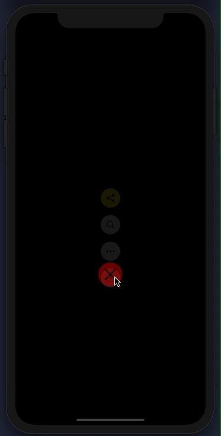

# React Native Expandable Circle Menu

React Native expandable circle menu library

## Demo

[]()

## Installation

First, download the library from npm:

```
npm install rn-expandable-circle-menu --save
```

## Usage

```javascript
import CircleMenu from 'rn-expandable-circle-menu'

const openMenuButton = {
  image: require('./assets/openMenu.png'),
}

const closeMenuButton = {
  image: require('./assets/closeMenu.png'),
  // You can override style of every item
  style: {
    backgroundColor: 'red'
  }
}

const menuItems = [
  {
    image: require('./assets/shareLogo.png'),
    onClick: () => {
      alert('Share button pressed')
    },
    style: {
      backgroundColor: 'yellow'
    }
  },
  {
    image: require('./assets/searchLogo.png'),
    onClick: () => {
      alert('Search button pressed')
    }
  },
  {
    image: require('./assets/moreLogo.png'),
    onClick: () => {
      alert('More button pressed')
    }
  },
  {
    image: require('./assets/downloadLogo.png'),
    onClick: () => {
      alert('Download button pressed')
    }
  },
];


const CircleMenuView = () => {
  return (
    <CircleMenu
      menuItems={menuItems}
      openMenuButton={openMenuButton}
      closeMenuButton={closeMenuButton}
    />
  )
}

```

## Props

| Name | Description | Type | Required |
| :--- | :----- | :--- | :---: |
| menuItems | Array of menu items | Array | YES | 
| openMenuButton | Object for open menu button | Object | YES | 
| closeMenuButton | Object for close menu button | Object | YES | 

### menuItems

| Name | Description | Type | Required |
| :--- | :----- | :--- | :---: |
| image | The icon of the item | Image | YES | 
| onClick | The function that called when pressed on menu item | Function | YES | 
| style | Style object to override style | Object | NO | 

### openMenuButton & closeMenuButton

| Name | Description | Type | Required |
| :--- | :----- | :--- | :---: |
| image | The icon of the item | Image | YES | 
| style | Style object to override style | Object | NO | 